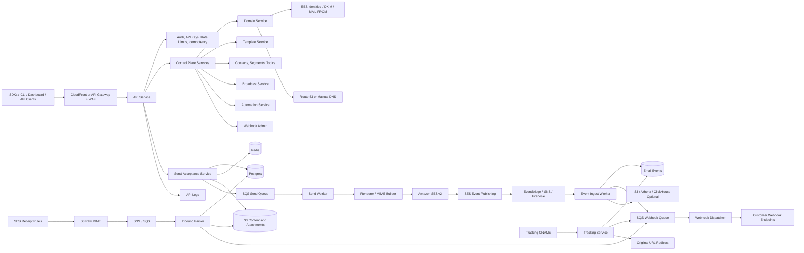

**Thesis**

Build a self-hostable, AWS-native email platform with Resend-level API ergonomics, not a mail server. SES should remain the delivery substrate; your product should be the control plane: API keys, domains, DNS verification, send orchestration, idempotency, templates, event normalization, logs, webhooks, inbound parsing, suppressions, contacts, broadcasts, automations, and a dashboard/CLI that makes AWS email infrastructure feel developer-native. Resend's public product surface now spans REST API auth, sending, batch sending, received email retrieval, domains, logs, API keys, webhooks, templates, contacts, contact properties, segments, topics, broadcasts, automations, and custom events; AWS SES supplies the underlying sending, identity, event, receiving, suppression, and storage primitives you can compose.  [oai_citation:0‡Resend](https://resend.com/docs/api-reference/introduction)

**The strategic position**

Your product should be "Resend-like UX for teams that want to own their AWS email stack." Do not compete by being a cheaper SMTP relay. Compete by being open, programmable, auditable, infra-native, migration-friendly, and brutally transparent about delivery state.

| Strategic choice | Decision |
|---|---|
| Product category | Open-source email API and control plane for AWS SES |
| Core user | Developers, platform teams, agencies, AWS-first startups, security-conscious teams |
| First wedge | Transactional email API with excellent domain onboarding, logs, events, webhooks, and SDKs |
| Durable wedge | Bring-your-own AWS account, transparent costs, source-available/open infrastructure, provider portability |
| What to copy | API ergonomics, resource model, developer docs quality, CLI feel, webhook semantics |
| What not to copy | Brand, proprietary implementation, hosted-only assumptions, opaque deliverability operations |
| What to avoid | Building your own MTA first, visual automation builder first, marketing-suite sprawl first, deliverability claims without evidence |
| Bold product line | "Own your email infra. Keep the developer experience." |

**Resend surface to match**

Resend's API is REST over HTTPS, uses bearer API keys, requires a `User-Agent`, supports cursor-style list responses, exposes rate-limit and quota signals, and returns typed errors. Your compatibility layer should mimic this closely so migration is mostly endpoint/base-URL replacement plus SDK swap.  [oai_citation:1‡Resend](https://resend.com/docs/api-reference/introduction)

| Surface | Resend capability | Your implementation target |
|---|---|---|
| Auth | Bearer API keys; full-access and sending-access behavior | Hashed API keys, scoped permissions, key prefixes, last-used tracking, key rotation, dashboard and API management |
| Sending | `POST /emails` with `from`, `to`, `subject`, `html`, `text`, `cc`, `bcc`, headers, tags, attachments, templates | SES-backed send API with request normalization, durable persistence, SQS fanout, SES v2 provider adapter |
| Batch sending | `POST /emails/batch`, up to 100 emails per request; per-email recipients max 50; batch idempotency; no attachments or scheduled sends in Resend compatibility mode | Compatibility endpoint with same limits; separate extended bulk/job endpoint for richer large sends |
| Scheduled email | Schedule, update, cancel | EventBridge Scheduler or durable scheduled-jobs table plus worker |
| Sent email retrieval | Retrieve/list sent emails and attachments | Message metadata in Postgres; content and attachments in S3; signed download APIs |
| Receiving | List/retrieve received emails and received attachments | SES receipt rules to S3, parser worker, inbound metadata API, attachment API |
| Domains | Create/list/retrieve/update/delete/verify; sending and receiving capabilities; region; DNS records | SES identities, DKIM records, custom MAIL FROM, MX/TXT generation, Route 53 automation, DNS polling |
| Tracking | Open and click tracking using tracking subdomain, CNAME, open pixel, and link rewriting | Tracking service behind CloudFront/ALB, tokenized redirect URLs, open pixel, bot heuristics, event normalization |
| Webhooks | Create/list/retrieve/update/delete; signed events; retries and replays | Webhook registry, signing secret, Svix-compatible headers or HMAC-compatible scheme, retry queue, replay API |
| Events | Email, domain, contact, and custom events | Append-only event ledger plus event API for automation triggers |
| Templates | Create, update, publish, duplicate, delete, use published templates for sends | Versioned template system, render validation, aliases, test rendering, React Email/Handlebars/Liquid support |
| Contacts | Contacts, properties, segments, topics, subscriptions | Contact graph, property schema, segment rules, topic opt-in/out, suppression enforcement |
| Broadcasts | Draft/update/send/list/retrieve/delete broadcasts | Segment snapshot, expansion jobs, send queue, per-recipient state, analytics |
| Automations | Custom-event-triggered automations with conditions, delays, waits, send-email, contact updates, segment steps | Workflow definitions, event matcher, durable runs, scheduled waits, state machine |
| Logs | API logs and retrieval | Request/response metadata, redacted bodies, error correlation, trace IDs |
| CLI | Send, manage account/resources, develop locally, agent-friendly workflows | CLI generated from OpenAPI plus `doctor`, `listen`, `tail`, `test-webhook`, `verify-domain` |

Resend's send API caps recipients at 50 per email and attachments at 40 MB after base64 encoding; its batch endpoint permits up to 100 emails and explicitly does not support attachments or scheduled sends. Mirror that in compatibility mode because migrations depend on edge-case behavior as much as happy paths.  [oai_citation:2‡Resend](https://resend.com/docs/api-reference/emails/send-email)

**Complete target architecture**



**Architecture principle**

Every API request that can cause email delivery must become durable before it can return success. Every provider callback must become an append-only internal event before it updates derived state. Every customer webhook must be delivered from your own retry queue, never inline from SES, EventBridge, SNS, or a request handler.

**AWS foundation**

SES v2 supports formatted sends where AWS assembles the MIME message, raw sends where your system builds the MIME message, and templated sends; this maps cleanly to a Resend-like API with simple HTML/text sends, custom headers, attachments, and advanced MIME cases. SES event publishing can emit sends, deliveries, opens, clicks, bounces, complaints, rejections, rendering failures, and delivery delays to CloudWatch, Firehose, Pinpoint, SNS, or EventBridge; this should feed your event ledger and webhook dispatcher.  [oai_citation:3‡AWS Documentation](https://docs.aws.amazon.com/ses/latest/dg/send-email-api.html)

| Need | AWS primitive | Design decision |
|---|---|---|
| Delivery | Amazon SES v2 | Primary provider adapter; one adapter interface so other providers can be added later |
| Domain identity | SES domain identities | One identity per domain per region; store SES identity ARN/status |
| DKIM | SES Easy DKIM or BYODKIM | Default to Easy DKIM; expose BYODKIM as advanced |
| MAIL FROM alignment | SES custom MAIL FROM | Generate `send.domain` MX/TXT records; support reject-on-failure mode for strict senders |
| DNS automation | Route 53 API | Auto-publish only when hosted zone exists in connected AWS account; otherwise show records |
| Send queue | SQS | Durable async dispatch; DLQ for permanent inspection |
| Scheduled sends | EventBridge Scheduler or jobs table | Use Scheduler for precise one-off jobs; jobs table for large batches |
| Events | SES configuration sets plus EventBridge/SNS/Firehose | Configuration set per tenant, stream, or pool depending on scale |
| Receiving | SES receipt rules | Store raw MIME in S3 and notify parser |
| Raw inbound storage | S3 | Store original MIME, parsed bodies, normalized attachments |
| Attachments | S3 plus SES v2 attachments/raw MIME | Store once, scan/validate, stream into SES request |
| Metadata | RDS Postgres | Source of truth for resources, messages, states, contacts, templates, suppressions |
| Rate limits | Redis | Token buckets per tenant, API key, endpoint, domain, provider region |
| Idempotency | Redis plus Postgres | Redis lock for concurrency; Postgres record for 24-hour response replay |
| Analytics | Postgres first; S3/Athena or ClickHouse later | Keep hot operational views in Postgres; archive event streams cheaply |
| Secrets | KMS and Secrets Manager | Encrypt webhook secrets, provider credentials, peppers, DKIM private keys if BYODKIM |
| Runtime | ECS/Fargate | Use stable long-running services and workers; avoid Lambda-only fragmentation |
| Static dashboard | S3/CloudFront or Next.js on ECS | Keep dashboard separate from API hot path |
| Edge protection | WAF, API Gateway or ALB | Request size limits, bot controls, IP reputation, rate prefilters |
| TLS for tracking | ACM plus CloudFront/ALB | Validate custom tracking domains before enabling rewrites |

SES quotas should be treated as product inputs, not backend surprises. SES quotas are regional; sandbox accounts are limited to 200 emails per 24 hours and 1 email per second; quotas are recipient-based rather than message-based; SES v2/SMTP messages can be up to 40 MB after base64 encoding; and SES has a hard 50-recipient-per-message cap. Your quota system should reject or throttle before SES does.  [oai_citation:4‡AWS Documentation](https://docs.aws.amazon.com/ses/latest/dg/quotas.html)

**System services**

| Service | Responsibility | Critical implementation details |
|---|---|---|
| API service | Public REST API, dashboard API, OpenAPI contract | Fast validation, auth, rate limits, idempotency, request logging, resource routing |
| Auth service | Users, teams, sessions, API keys, scopes | API keys shown once, stored hashed, scoped as sending-only or full-access |
| Tenant service | Team/workspace model | Tenant ID on every row; optional row-level security; audit trail |
| Domain service | Domain lifecycle and DNS records | SES identity creation, DKIM record capture, MAIL FROM records, tracking CNAME, receiving MX, verification polling |
| DNS verifier | Periodic DNS checks | Checks SPF, DKIM, MAIL FROM, MX, CNAME, CAA when relevant; exposes `doctor` output |
| Send acceptance service | Synchronous send request handling | Normalize payload, enforce policy, persist message, enqueue send, return ID |
| Renderer | HTML/text/template rendering | React Email compile, text generation, variable validation, unsubscribe injection |
| MIME builder | SES request construction | Simple SES request where possible; raw MIME for complex headers, inline attachments, unusual structures |
| Send worker | Calls SES and handles provider errors | Per-region throttling, retry policy, SES MessageId persistence, permanent-vs-transient classification |
| Scheduler | Scheduled send lifecycle | Update/cancel before dispatch; exact run state transitions |
| SES event ingester | Consumes EventBridge/SNS/Firehose events | Dedupe, map SES provider event to internal event, update recipient/message state |
| Event ledger | Append-only events | Immutable event rows, dedupe keys, normalized payloads, raw provider payload references |
| Webhook dispatcher | Customer webhook delivery | Signed payloads, exponential retry, delivery attempt logs, replay, endpoint disable rules |
| Inbound parser | Parses raw MIME | Headers, HTML, text, attachments, spam verdicts, threading metadata, webhook metadata-only event |
| Tracking service | Open/click tracking | Link tokens, safe redirects, open pixel, bot scoring, custom tracking domain routing |
| Template service | Template lifecycle | Draft/published versions, aliases, variable schemas, render previews |
| Contacts service | Contacts, properties, topics | Uniqueness by tenant/email, typed property schema, consent state |
| Segment service | Static and dynamic segments | SQL-safe rule engine, materialized membership snapshots for broadcasts |
| Broadcast service | Campaign-style sends | Segment snapshot, recipient expansion, compliance checks, throttled send fanout |
| Automation service | Event-triggered workflows | Triggers, conditions, delays, waits, send-email steps, contact mutations, durable runs |
| Logs service | API and email observability | Redaction, search, filters, correlation IDs, raw provider payload links |
| Usage service | Quotas and billing hooks | Daily/monthly counters, recipient counters, API counters, tenant plan limits |
| CLI | Developer operations | `send`, `domains`, `logs`, `webhooks`, `receiving listen`, `doctor`, `replay`, `tail` |
| SDK generator | Client libraries | TypeScript first; Python, Go, Ruby, PHP, Rust, Java, .NET generated or hand-polished |
| Admin/ops service | Internal safety controls | Tenant suspension, quota override, domain lock, webhook disable, audit views |

**Data model**

Use Postgres as the authoritative store. Keep full message bodies, raw MIME, and attachments in S3; keep searchable metadata, states, counters, and references in Postgres. Partition high-volume operational tables by tenant and time, especially `email_events`, `api_logs`, `webhook_attempts`, and `email_recipients`.

| Domain | Tables |
|---|---|
| Tenancy and auth | `tenants`, `users`, `memberships`, `roles`, `api_keys`, `api_key_scopes`, `sessions`, `audit_logs` |
| Provider config | `provider_accounts`, `provider_regions`, `ses_configuration_sets`, `ses_event_destinations`, `dedicated_ip_pools`, `provider_quota_snapshots` |
| Domains | `domains`, `domain_identities`, `domain_dns_records`, `domain_verification_checks`, `mail_from_domains`, `tracking_domains`, `receiving_routes` |
| Sending | `email_messages`, `email_recipients`, `email_contents`, `email_attachments`, `send_attempts`, `scheduled_sends`, `idempotency_keys`, `message_tags` |
| Events | `email_events`, `event_dedupe_keys`, `provider_events_raw`, `custom_events`, `event_schemas` |
| Webhooks | `webhooks`, `webhook_event_subscriptions`, `webhook_secrets`, `webhook_attempts`, `webhook_replays`, `webhook_endpoint_health` |
| Templates | `templates`, `template_versions`, `template_aliases`, `template_variables`, `template_render_tests`, `template_assets` |
| Contacts | `contacts`, `contact_properties`, `contact_property_values`, `contact_imports`, `contact_import_rows`, `contact_events` |
| Consent | `topics`, `topic_subscriptions`, `unsubscribe_tokens`, `consent_events`, `suppression_entries`, `suppression_overrides` |
| Segments | `segments`, `segment_rules`, `segment_memberships`, `segment_snapshots`, `segment_snapshot_members` |
| Broadcasts | `broadcasts`, `broadcast_versions`, `broadcast_recipient_snapshots`, `broadcast_recipients`, `broadcast_metrics_rollups` |
| Automations | `automation_definitions`, `automation_versions`, `automation_steps`, `automation_edges`, `automation_runs`, `automation_step_runs`, `automation_waits` |
| Receiving | `inbound_emails`, `inbound_recipients`, `inbound_attachments`, `inbound_headers`, `inbound_routes`, `inbound_parse_errors` |
| Tracking | `tracking_links`, `tracking_clicks`, `tracking_opens`, `tracking_tokens`, `tracking_bot_signals` |
| Logs and usage | `api_logs`, `usage_counters`, `quota_limits`, `rate_limit_overrides`, `billing_events`, `system_health_checks` |

**Email message state machine**

Expose user-facing states that match developer expectations, and keep provider-specific states internal.

| State | Meaning |
|---|---|
| `scheduled` | Send is accepted but not yet eligible for dispatch |
| `queued` | Send is durable and waiting for worker dispatch |
| `sent` | Public compatibility event: API accepted the message and the system will attempt delivery |
| `submitted` | Internal provider event: SES accepted the send request |
| `delivery_delayed` | Provider reported temporary delivery delay |
| `delivered` | Recipient mail server accepted the message |
| `bounced` | Recipient mail server permanently rejected the message |
| `complained` | Recipient marked the delivered email as spam |
| `opened` | Tracking pixel was requested |
| `clicked` | Tracking link was requested and redirected |
| `suppressed` | Message was blocked by local or provider suppression policy |
| `failed` | System could not submit or continue the send |
| `cancelled` | Scheduled send was cancelled before dispatch |

Resend's webhook model includes `email.bounced`, `email.clicked`, `email.complained`, `email.delivered`, `email.delivery_delayed`, `email.failed`, `email.opened`, `email.received`, `email.scheduled`, `email.sent`, `email.suppressed`, plus domain and contact events. Use those external names, and add richer internal events only where they improve operations.  [oai_citation:5‡Resend](https://resend.com/docs/webhooks/event-types)

**API contract**

| Resource | Compatibility endpoints | Extended endpoints you should add |
|---|---|---|
| Emails | `POST /v1/emails`, `POST /v1/emails/batch`, `GET /v1/emails`, `GET /v1/emails/:id`, `PATCH /v1/emails/:id`, `POST /v1/emails/:id/cancel`, attachment list/retrieve | `POST /v1/email-jobs`, `GET /v1/email-jobs/:id`, `POST /v1/emails/:id/retry`, `GET /v1/emails/:id/events` |
| Domains | `POST /v1/domains`, `GET /v1/domains`, `GET /v1/domains/:id`, `PATCH /v1/domains/:id`, `POST /v1/domains/:id/verify`, `DELETE /v1/domains/:id` | `GET /v1/domains/:id/doctor`, `POST /v1/domains/:id/publish-route53`, `GET /v1/domains/:id/dns-checks` |
| Webhooks | `POST /v1/webhooks`, `GET /v1/webhooks`, `GET /v1/webhooks/:id`, `PATCH /v1/webhooks/:id`, `DELETE /v1/webhooks/:id` | `GET /v1/webhooks/:id/attempts`, `POST /v1/webhooks/:id/replay`, `POST /v1/webhooks/test` |
| Templates | Create, retrieve, list, update, delete, publish, duplicate | Render preview, variable schema validation, aliases, rollback |
| Contacts | Create, retrieve, list, update, delete, segment add/remove, topic subscriptions | Bulk import, upsert, export, consent history |
| Segments | Create, retrieve, list, delete, list contacts | Dynamic rules, snapshot, estimate count |
| Topics | Create, retrieve, list, update, delete | Hosted preference center |
| Broadcasts | Create, retrieve, list, update, delete, send | Pause, resume, cancel, clone, A/B test |
| Automations | Create, retrieve, list, update, stop, delete, list/retrieve runs | Replay run, inspect wait state, validate graph |
| Events | Create, send, retrieve, list, update, delete | Schema validation, replay into automation engine |
| Logs | List, retrieve | Tail, export, saved filters |
| API keys | Create, list, delete | Rotate, restrict by IP, expire, last-used audit |

**API protocol rules**

| Concern | Required behavior |
|---|---|
| Auth | `Authorization: Bearer <key>`; no API key in query params; dashboard uses session auth but API actions still map to tenant permissions |
| User agent | Reject or warn on missing user agent in compatibility mode; record SDK name/version for support |
| Pagination | Return `{ object: "list", has_more, data }`; support `limit`, `after`, `before`; default 20; max 100 |
| Idempotency | Accept `Idempotency-Key`; length 1-256; persist request hash and response for 24 hours; return same response for same payload; return conflict for same key with different payload; return conflict while first request is in flight |
| Rate limits | Team-level token bucket by default; endpoint-specific overrides; response headers for limit, remaining, reset, retry-after |
| Errors | Stable `{ name, statusCode, message }` shape; typed errors for invalid key, missing key, invalid attachment, invalid sender, invalid region, quota exceeded, rate limit exceeded |
| Request IDs | Include `request_id` in every response and log row |
| API versioning | `/v1` URI plus OpenAPI version; breaking changes only in major versions |
| Compatibility mode | Preserve Resend-compatible limits and response shapes |
| Native mode | Add richer job APIs, bulk endpoints, Route 53 automation, domain doctor, replay, and export |

Resend documents cursor pagination, 24-hour idempotency behavior, typed idempotency conflicts, rate-limit headers, quota headers, and a default API rate limit of 5 requests per second per team. Your defaults can differ in native mode, but your compatibility mode should make these semantics familiar.  [oai_citation:6‡Resend](https://resend.com/docs/api-reference/pagination)

**Outbound send flow**

| Step | Action | Success condition |
|---|---|---|
| Request ingress | Edge accepts HTTPS request and forwards to API | Request has trace ID and sane body size |
| Auth | Validate API key, tenant, scopes, key status | Sending endpoint allows sending-access or full-access key |
| Rate limit | Apply tenant/API-key/endpoint/domain buckets | Headers returned on every response |
| Idempotency lock | Lock key and compare payload hash | Duplicate safe retry returns original response |
| Normalize | Parse addresses, friendly names, headers, tags, template reference, attachments | Canonical payload created |
| Policy | Verify sender domain ownership, capabilities, verified status, suppression, quotas | Bad sends fail before queueing |
| Render preflight | Validate template exists, published version exists, variables satisfy schema | No missing variable surprises after API success |
| Store | Persist message, recipients, content refs, attachment refs, initial event | Single transaction commits |
| Enqueue | Push send job to SQS | Job includes tenant, message, recipient grouping, provider region |
| Respond | Return email ID or batch IDs | Response persisted for idempotent replay |
| Dispatch | Worker builds SES request and submits | SES MessageId stored |
| Provider events | SES publishes event into EventBridge/SNS/Firehose | Event mapped to message/recipient |
| Customer events | Internal event fans out to webhooks, logs, metrics, broadcast stats, automation waits | Webhook attempts are durable and replayable |

**Batch and bulk strategy**

| Mode | Purpose | Rules |
|---|---|---|
| Compatibility batch | Match Resend's `POST /emails/batch` | Up to 100 emails, each email max 50 recipients, no attachments, no scheduled sends, one idempotency key for the batch |
| Native batch | Developer convenience beyond compatibility | Allow attachments and schedules if implementation can guarantee durability and memory safety |
| Bulk job | Large transactional workloads | Accept a job, store input in S3, validate asynchronously, expose progress and partial failures |
| Broadcast | Marketing/product messaging to contacts | Requires contacts/segments/topics, unsubscribe enforcement, segment snapshot, throttled delivery |
| Automation send | Workflow-driven sends | Requires published template and contact/event context |

**Domain architecture**

SES domain identity creation should drive your domain record model. SES uses DKIM to verify domain ownership, supports Easy DKIM and BYODKIM, and custom MAIL FROM requires MX and TXT records. Resend's domain creation response exposes region, capabilities, DKIM CNAMEs, MAIL FROM-style SPF records, and tracking CNAMEs; your API should return the same conceptual record list, but generated from SES and your tracking service.  [oai_citation:7‡AWS Documentation](https://docs.aws.amazon.com/ses/latest/dg/creating-identities.html)

| Domain feature | Implementation |
|---|---|
| Domain creation | Create DB row; create SES identity in selected region; request DKIM tokens; create DNS record rows |
| Region selection | Support AWS SES regions; mark receiving availability separately because SES receiving is not available everywhere |
| DKIM | Return CNAME records; poll SES identity status; verify DNS directly too |
| MAIL FROM | Default `send.<domain>`; return MX `feedback-smtp.<region>.amazonses.com` and TXT `v=spf1 include:amazonses.com ~all` |
| SPF | Expose TXT record for MAIL FROM; avoid encouraging multiple SPF TXT records at root |
| DMARC | Check presence and alignment; do not require strict policy for initial transactional sends |
| Tracking | Create `links.<domain>` CNAME; issue/attach certificate; only enable rewriting after verified |
| Receiving | Create receiving MX record and SES receipt rule path; recommend subdomain when root already has MX records |
| DNS automation | If Route 53 zone exists, publish records; otherwise provide copyable records |
| Verification | `POST /domains/:id/verify` triggers active checks; background poller keeps state current |
| Domain lock | Prevent multiple tenants from claiming same domain unless admin override proves ownership transfer |
| Deletion | Preserve historical email records; disable sending; optionally keep tracking proxy alive for old links |

SES email receiving can accept mail for domains, scan/filter messages, and use receipt rules to deliver raw MIME to S3 or publish notifications; SES receiving is only available in supported regions. Build region/capability awareness into the domain object rather than treating receiving as a universal toggle.  [oai_citation:8‡AWS Documentation](https://docs.aws.amazon.com/ses/latest/dg/receiving-email.html)

**Inbound receiving flow**

| Step | Action | Success condition |
|---|---|---|
| DNS | User adds MX for root or subdomain | SES receives mail for verified receiving domain |
| Receipt rule | SES stores raw MIME in S3 and sends notification | Raw message object exists before parser runs |
| Parser | Worker parses MIME, headers, text, HTML, attachments, threading metadata | `inbound_emails` row created |
| Attachment storage | Attachments saved to S3 with metadata | Retrieval API can stream attachment |
| Event | Emit `email.received` with metadata only | Webhook does not need huge body payload |
| Retrieval | User calls received-email and attachment APIs | Body, headers, raw MIME, attachments available |
| Routing | Optional inbound route rules | Support aliases, catch-all, forwarding, automation trigger |

Resend's inbound design sends `email.received` webhooks with metadata and requires API calls to retrieve body, headers, and attachments, which is the right pattern for serverless-safe payload sizes and durable retrieval.  [oai_citation:9‡Resend](https://resend.com/docs/dashboard/receiving/introduction)

**Open and click tracking architecture**

Resend's tracking is disabled by default, requires domain-level open/click settings plus a verified tracking subdomain, inserts a transparent 1×1 pixel for opens, and rewrites HTML links for clicks. Your tracking service should copy those mechanics, but add explicit bot classification and per-message opt-out.  [oai_citation:10‡Resend](https://resend.com/docs/dashboard/domains/tracking)

| Tracking concern | Design |
|---|---|
| Domain verification | Tracking CNAME points to your tracking edge; certificate issued before activation |
| Link rewriting | HTML renderer replaces eligible URLs with signed tracking URLs |
| Click endpoint | Validate token, append click event, redirect with 302/307 to original URL |
| Open pixel | Append tracking GIF when enabled; return cache-controlled 1×1 transparent GIF |
| Bot handling | Record all hits, classify suspicious hits, expose "raw" and "filtered" metrics |
| Privacy controls | Domain-level default; message-level override; topic/broadcast-level policy |
| Old links | Never delete tracking route mappings for historical emails unless user explicitly accepts breakage |
| Safety | Deny javascript/data URLs; preserve unsubscribe and signed URLs when configured |

**Webhook architecture**

Resend uses signed webhooks with raw-body verification and Svix-style headers; webhooks are vulnerable to forged requests and replay attacks, so each endpoint needs a signing secret and timestamped signature verification. Your outbound webhooks should be signed, durable, replayable, inspectable, and never dispatched from the same process that ingests SES events.  [oai_citation:11‡Resend](https://resend.com/docs/webhooks/verify-webhooks-requests)

| Webhook feature | Design |
|---|---|
| Event selection | Endpoint subscribes to event types |
| Signing | Use Svix-compatible implementation or a clearly documented HMAC scheme; include ID, timestamp, signature |
| Secret handling | Show signing secret once; store encrypted; support rotation with overlapping secrets |
| Delivery | SQS queue per event; dispatcher sends HTTPS POST |
| Retries | Exponential backoff with jitter; cap attempts; dead-letter after terminal failure |
| Replays | Replay one event, all failed attempts, or all events in a time range |
| Logs | Store request URL, status, latency, response snippet, attempt count, next retry |
| Endpoint health | Auto-disable after sustained failure; notify dashboard/API |
| Local dev | CLI listener or forwarder for testing webhooks |
| Security | Require HTTPS outside local/dev mode; verify DNS/IP safety to reduce SSRF risk |

**Template architecture**

| Feature | Design |
|---|---|
| Engines | React Email for TypeScript users; Handlebars or Liquid for language-neutral templates |
| Versions | Draft and published versions; sends can only use published versions |
| Aliases | Human alias like `welcome` points to a published version |
| Variables | Variable schema, reserved variables, default values, validation before send |
| Rendering | Store rendered HTML/text snapshot or S3 reference per sent email for auditability |
| Text fallback | Generate text from HTML by default unless explicitly blank |
| Assets | Inline images and hosted assets stored in S3; CID support for inline attachments |
| Testing | Render preview, test send, snapshot diff, missing-variable errors |

**Contacts, topics, suppressions, and consent**

Do not treat contacts as an address book bolted onto sending. Contacts are the compliance layer for broadcasts and automations. Suppression checks must run for every outbound recipient, including transactional sends, with explicit override rules only for truly exceptional cases.

| Feature | Design |
|---|---|
| Contact identity | Unique by normalized email per tenant |
| Properties | Typed custom fields with schema validation |
| Topics | Subscription categories with default opt-in or opt-out behavior |
| Consent ledger | Append-only consent events: subscribed, unsubscribed, resubscribed, imported, manual override |
| Suppressions | Local suppression list for hard bounces, complaints, manual blocks, topic/global unsubscribes |
| SES suppression sync | Optionally push hard bounce/complaint suppressions into SES account-level suppression |
| Unsubscribe | Hosted preference center plus signed unsubscribe URL |
| List headers | Add `List-Unsubscribe` and `List-Unsubscribe-Post` for non-transactional mail |
| Broadcast eligibility | Recipient must be contact, not globally suppressed, subscribed to required topic |
| Transactional eligibility | Allow transactional send unless hard-bounced/complained/manual-blocked |

AWS SES has an account-level suppression list that applies within the current AWS Region, supports bounce/complaint reasons, can be managed through SES API v2, and can be enabled at account or configuration-set level. Use SES suppression as a provider safety net, but keep your own tenant-aware suppression system as the product source of truth.  [oai_citation:12‡AWS Documentation](https://docs.aws.amazon.com/ses/latest/dg/sending-email-suppression-list.html)

**Broadcast architecture**

| Component | Design |
|---|---|
| Draft | Subject, sender, template/content, topic, segment, tracking policy |
| Validation | Domain verified, template published, topic selected, unsubscribe present, segment count estimated |
| Snapshot | Freeze segment membership at send start |
| Expansion | Create `broadcast_recipients` rows and enqueue sends in controlled batches |
| Throttling | Per-tenant, per-domain, per-provider-region, and campaign-level limits |
| Per-recipient state | Queued, sent, delivered, bounced, complained, opened, clicked, suppressed |
| Metrics | Derived from event ledger, not directly from worker counters |
| Pause/cancel | Stop future expansion/dispatch; do not retract already submitted emails |
| Resume | Continue from durable recipient state |
| Audit | Preserve content version, segment snapshot, send settings, and eligibility decisions |

**Automation architecture**

Resend automations are triggered by custom events and support conditions, delays, waits, send-email steps, contact updates/deletes, and segment membership changes; only published templates should be usable in automation send steps.  [oai_citation:13‡Resend](https://resend.com/docs/dashboard/automations/introduction)

| Component | Design |
|---|---|
| Event API | `POST /events/:name` or `POST /events` with user/contact/entity payload |
| Event schema | Optional JSON schema for validation and docs |
| Trigger matcher | Matches event name and tenant to active automation versions |
| Versioning | Runs bind to immutable automation version |
| Steps | Trigger, condition, delay, wait-for-event, send-email, contact update, contact delete, add-to-segment |
| Runs | One durable run per trigger match; state stored in `automation_runs` and `automation_step_runs` |
| Delays | Scheduler table or EventBridge Scheduler |
| Waits | Wait rows keyed by tenant, contact/entity, event name, timeout |
| Send step | Requires published template; renders with event/contact context |
| Debugging | Run graph, step logs, input/output payloads, retry reason |
| Safety | Max run depth, max waits, loop prevention, idempotent event handling |

**Provider abstraction**

Design around SES first, but do not hardcode SES into the product model.

| Interface | Required methods |
|---|---|
| `EmailProvider` | `sendEmail`, `sendRawEmail`, `sendBulkEmail`, `getQuota`, `classifyError` |
| `IdentityProvider` | `createDomainIdentity`, `getIdentityStatus`, `deleteIdentity`, `setMailFrom`, `getDkimRecords` |
| `EventProvider` | `configureEvents`, `parseProviderEvent`, `dedupeKey`, `mapEventType` |
| `ReceivingProvider` | `configureReceiving`, `parseInboundNotification`, `rawObjectReference` |
| `SuppressionProvider` | `putSuppression`, `removeSuppression`, `listSuppressions` |
| `DnsProvider` | `findZone`, `publishRecords`, `checkRecords` |

This keeps SES as the default production path while making room for Postmark, Mailgun, SMTP, or a future self-hosted MTA plugin without rewriting the API, dashboard, events, contacts, or webhooks.

**Deliverability strategy**

SES configuration sets can publish event metrics and can associate different dedicated IP pools with different mail streams, such as marketing versus transactional mail. Use that primitive to separate reputation, policies, throttles, and observability by stream.  [oai_citation:14‡AWS Documentation](https://docs.aws.amazon.com/ses/latest/dg/using-configuration-sets.html)

| Area | Policy |
|---|---|
| Streams | Separate transactional, product, marketing, test, and risky/cold-start streams |
| Domain authentication | DKIM required before production sending; MAIL FROM strongly recommended; DMARC checked and explained |
| Suppression | Hard bounces and complaints automatically suppress; manual unsuppress requires reason |
| Complaints | Immediate suppression and dashboard alert |
| Bounces | Classify hard vs soft; hard suppress; soft retry according to provider signal |
| Warmup | Domain/IP warmup controls for high-volume senders |
| Quotas | Product quotas lower than SES quotas to preserve headroom |
| Throttling | Recipient-based throttles, not just request-based throttles |
| Recipient quality | Import validation, duplicate detection, role-address warnings, typo domain checks |
| Tracking | Disabled by default; explicit enablement; filtered metrics |
| Testing | SES mailbox simulator support, test-mode domains, event simulation endpoints |
| Domain doctor | SPF, DKIM, DMARC, MAIL FROM, tracking CNAME, receiving MX, SES region, sandbox, event destinations |
| Abuse prevention | New tenant restrictions, content scanning hooks, velocity caps, suspicious bounce/complaint triggers |

**Security architecture**

| Layer | Requirements |
|---|---|
| API keys | Prefix plus secret; store only keyed hash; show once; support expiration, scopes, rotation, deletion |
| Dashboard auth | MFA-ready user auth, session revocation, role-based team access |
| Secrets | KMS envelope encryption for webhook secrets, provider secrets, BYODKIM private keys |
| Data isolation | Tenant ID everywhere; scoped queries; optional Postgres RLS for defense in depth |
| Webhooks | Signed payloads, timestamp verification, replay protection, secret rotation |
| Attachments | Size/type validation, malware scanning hook, S3 encryption, lifecycle policies |
| Logs | Redact secrets, auth headers, large bodies, attachment content |
| Audit | Immutable audit events for key creation/deletion, domain changes, webhook changes, suppression overrides |
| SSRF defense | Validate remote attachment URLs and webhook destinations; block internal/private IP ranges unless explicitly allowed in self-host mode |
| IAM | Least-privilege roles per service; no broad SES/S3 wildcard beyond required resources |
| Network | Private subnets for workers/DB/Redis; public edge only for API/tracking/webhooks as needed |
| Compliance posture | Data export, data deletion, retention controls, PII minimization, regional deployment option |

**Observability architecture**

| Signal | Implementation |
|---|---|
| Request trace | `request_id` on every response, log row, queue job, and event |
| Message trace | `email_id`, `recipient_id`, `provider_message_id`, `configuration_set`, `tenant_id` |
| Logs | API logs, send attempts, provider raw events, webhook attempts |
| Metrics | Accepted sends, submitted sends, deliveries, bounces, complaints, opens, clicks, suppressions, failures |
| Latency | API accept latency, queue wait, provider submit latency, event ingest latency, webhook delivery latency |
| Reliability | Queue depth, DLQ count, webhook failure rate, event dedupe rate, worker retry rate |
| Domain health | DNS status, SES verification, MAIL FROM verification, tracking status, receiving status |
| Cost | SES spend estimate, S3 storage, DB write volume, event archive size, webhook attempt volume |
| Alerting | SES throttling, bounce/complaint spikes, event ingest stall, queue backlog, webhook outage, domain verification regression |

**Repository structure**

```txt
/open-email-platform
  /apps
    /api
    /dashboard
    /worker-send
    /worker-events
    /worker-webhooks
    /worker-inbound
    /worker-scheduler
    /tracking-service
    /cli
  /packages
    /core
    /schemas
    /openapi
    /sdk-js
    /sdk-python
    /sdk-go
    /sdk-ruby
    /provider-ses
    /provider-smtp
    /dns-route53
    /renderer-react-email
    /renderer-handlebars
    /mime
    /webhook-signing
    /rate-limits
    /idempotency
  /infra
    /terraform
    /docker-compose
    /helm
    /aws-reference-architecture
  /docs
    /api
    /self-hosting
    /aws
    /deliverability
    /migration
    /operations
  /examples
    /nextjs
    /node
    /python
    /go
    /lambda
    /webhooks
```

**Technology decisions**

| Area | Recommendation |
|---|---|
| Language | TypeScript for API, dashboard, CLI, SDK, renderers, and initial workers |
| API framework | Fastify or Hono with explicit schema validation; avoid framework magic in the send path |
| Database | Postgres with Kysely/Drizzle; UUIDv7 or ULID IDs; partition high-volume tables |
| Queue | SQS standard queues with DLQs; FIFO only where ordering is truly required |
| Cache | Redis for rate limits, idempotency locks, short-lived quota cache |
| Storage | S3 for bodies, attachments, raw MIME, raw provider payload archive |
| Workers | ECS/Fargate services with horizontal scaling |
| Dashboard | Next.js or React SPA backed by API |
| CLI | Node-based CLI for fastest SDK/schema reuse |
| IaC | Terraform as the primary OSS deployment path; CDK optional later |
| Analytics | Postgres rollups first; S3/Athena for archive; ClickHouse once event volume demands it |
| Workflow engine | Postgres/SQS/EventBridge Scheduler first; Temporal only when automation complexity justifies it |
| Webhook signing | Svix-compatible library or small audited HMAC module |
| Docs | OpenAPI-generated API docs plus hand-written operational docs |

**Task inventory**

| Workstream | Tasks | Definition of done |
|---|---|---|
| Product contract | Define OpenAPI schema, compatibility mode, native extensions, error schema, event taxonomy | SDKs generate from schema; golden API tests assert response shapes |
| Tenancy and auth | Build tenants, users, memberships, roles, API keys, scopes, session auth | API keys can be created/listed/deleted; sending-only keys cannot manage domains/webhooks |
| API foundation | Request IDs, validation, pagination, rate-limit headers, errors, logs | Every endpoint has schema validation, stable errors, request log, trace ID |
| Idempotency | Implement idempotency table, Redis lock, request hash, 24-hour replay | Duplicate retry returns same response; different payload conflicts; concurrent request conflicts |
| Domain service | SES identity creation, DKIM record storage, MAIL FROM records, capabilities, region handling | Domain create returns full DNS record list and status |
| DNS verification | Poll SES identity, query DNS, detect SPF/DKIM/MX/CNAME/CAA, expose domain doctor | `doctor` explains every failing record with exact expected value |
| Route 53 automation | Hosted-zone discovery, record publishing, least-privilege IAM | User can publish DNS records automatically when zone exists |
| SES provider adapter | Implement send simple, send raw, attachments, tags, configuration set, quota fetch, error classification | Send worker can submit HTML/text, custom headers, attachments, and tags |
| Send API | Implement `POST /emails`, validation, policy checks, persistence, queueing, response | API returns ID after durable commit; no email can be sent without DB state |
| Batch API | Implement `POST /emails/batch` with compatibility limits | Up to 100 emails accepted; unsupported fields rejected in compatibility mode |
| Scheduled sends | Schedule, update, cancel, dispatch eligibility, race-safe cancellation | Cancelled scheduled sends never dispatch; dispatched sends cannot be cancelled |
| Attachments | S3 staging, size checks, content type, inline support, retrieval APIs | Large attachments do not bloat DB; send and retrieve paths work |
| Templates | Draft/publish/version/duplicate/delete, variable schemas, render preview | Only published templates can be used in sends and automations |
| Renderer | React Email compile, HTML/text handling, unsubscribe variable injection | Render failures are caught before accepted send where possible |
| Event ingest | EventBridge/SNS consumer, raw event archive, dedupe, internal mapping | SES events update recipient state once and append immutable event rows |
| Webhooks | Endpoint CRUD, signing, retry, replay, attempts, health | Failed customer endpoint does not lose events; replay works |
| Logs | API logs, email logs, event timeline, filters, redaction | Dashboard can show request, send attempt, provider event, webhook attempts for one email |
| Suppression | Local suppression list, bounce/complaint automation, manual suppress/unsuppress, SES sync option | Hard-bounced and complained recipients are blocked before send |
| Contacts | Contact CRUD, import, properties, upsert, search | Contacts are unique per tenant/email and retain consent history |
| Topics | Topic CRUD, contact topic subscriptions, default subscription behavior | Broadcast eligibility can check topic state |
| Segments | Static segments, dynamic rules, materialized snapshots | Broadcasts use immutable segment snapshots |
| Broadcasts | Draft, validate, send, expand recipients, throttle, pause/resume/cancel | Broadcast metrics derive from per-recipient event state |
| Automations | Custom events, triggers, steps, waits, delays, runs, run debugger | Event can start a run; delay and wait states resume correctly |
| Inbound | SES receipt rule setup, S3 raw MIME, parser, inbound APIs, received webhooks | Incoming email creates retrievable body and attachment records |
| Tracking | Tracking domain, CNAME verification, open pixel, click redirect, bot classification | Open/click events emit and old links remain resolvable |
| CLI | Auth config, send, domains, logs, webhooks, receiving listen, doctor | New user can verify domain, send email, and debug DNS from terminal |
| SDKs | TypeScript SDK, Python SDK, Go SDK, examples | SDKs support send, batch, domains, webhooks, templates, contacts |
| Dashboard | Onboarding, domains, emails, logs, webhooks, templates, contacts, broadcasts | User can complete first verified send without touching AWS console |
| Infra | Terraform modules for API, workers, RDS, Redis, SQS, S3, SES events, IAM | One reference deployment creates all required AWS infrastructure |
| Local dev | Docker Compose, local DB, Redis, fake SES provider, fake webhook receiver | Contributors can run tests and simulate send/event/webhook locally |
| Testing | Unit, integration, contract, load, chaos, security tests | CI blocks schema drift, duplicate sends, webhook signature regressions |
| Migration | Resend-compatible endpoint docs, SDK migration guide, domain migration guide | Existing simple Resend send code can migrate by changing client/base URL and key |
| Documentation | API docs, AWS setup, deliverability, self-hosting, troubleshooting | Docs cover first send, verified domain, webhooks, inbound, and operations |
| Governance | License, contributor guide, plugin architecture, release policy | External contributors can add providers or SDK fixes without touching core internals |

**Measures of success**

| Area | Measure | Target |
|---|---|---|
| API compatibility | Simple Resend send examples work against compatibility client | 95%+ of transactional send use cases migrate without payload rewrite |
| Send acceptance | `POST /emails` p95 latency excluding large attachment upload | Under 250 ms for normal HTML/text sends |
| Durability | Accepted send lost after API success | Zero tolerated in tests and production incidents |
| Idempotency | Duplicate email caused by client retry with same key | Zero tolerated |
| Queue health | Send queue p95 wait under normal load | Under 5 seconds |
| Provider submission | SES throttling handled without message loss | 100% retried or classified with final state |
| Event freshness | Provider event to visible email timeline | p95 under 10 seconds |
| Webhook delivery | Event to first webhook attempt | p95 under 30 seconds |
| Webhook reliability | Successful delivery for healthy endpoints | 99.9%+ within retry window |
| Domain onboarding | Verified Route 53 domain from create to ready | One command or one dashboard action after permissions |
| DNS clarity | Failed domain verification support tickets | Declines as `doctor` explains exact failing record |
| Suppression safety | Hard bounce or complaint sent again accidentally | Zero tolerated without explicit override |
| Inbound durability | Received email lost while customer webhook is down | Zero tolerated; retrievable via API |
| Tracking correctness | Click redirects that fail because of tracking service | Under 0.1% excluding customer/origin failures |
| Logs usefulness | Email support investigation without database shell | 100% of standard investigations possible from dashboard/CLI |
| Cost control | Metadata stored in DB rather than S3 for large payloads | No full attachment/raw MIME bodies in Postgres |
| Security | Plaintext API keys or webhook secrets retrievable after creation | Zero |
| OSS activation | Fresh contributor local setup | Runs with Docker Compose and seeded fake provider |
| Developer UX | First test email using sandbox/fake provider | Single documented command path |
| Production UX | First verified SES-backed email | Domain doctor plus one send command |
| Operational maturity | Critical alerts wired | Queue backlog, event ingest stall, webhook failure spike, bounce/complaint spike, SES throttle spike |

**Build order by dependency**

| Build block | Exit condition |
|---|---|
| Foundation | OpenAPI, auth, tenants, API keys, request logs, rate limits, idempotency, Postgres, Redis, SQS, S3, Terraform skeleton |
| Transactional core | Domain verification, SES provider, send API, batch API, send worker, event ingest, email logs |
| Webhook core | Event ledger, webhook CRUD, signing, retries, attempts, replay |
| Deliverability core | Suppression, bounce/complaint handling, quotas, domain doctor, MAIL FROM, configuration sets |
| Developer experience | TypeScript SDK, CLI, examples, local fake provider, migration docs |
| Dashboard core | Onboarding, domains, emails, logs, webhooks, API keys |
| Content layer | Attachments, templates, render previews, scheduled sends |
| Inbound layer | SES receiving, raw MIME storage, parser, received-email APIs, inbound webhooks |
| Marketing layer | Contacts, properties, topics, segments, unsubscribe center |
| Broadcast layer | Broadcast draft/send, segment snapshots, recipient expansion, campaign metrics |
| Automation layer | Custom events, workflow definitions, runs, delays, waits, send-email steps |
| Scale layer | Multi-region routing, dedicated IP pool mapping, analytics archive, ClickHouse/Athena, provider marketplace |

**Hard engineering rules**

| Rule | Reason |
|---|---|
| API success means durable persistence, not provider delivery | Prevents invisible message loss |
| Customer webhooks are side effects of internal events, not provider callbacks | Enables replay, retries, audit, and isolation |
| Suppression checks happen before every send job | Protects sender reputation and compliance |
| Segment membership is snapshotted for broadcasts | Makes campaign results reproducible |
| Historical tracking links stay resolvable | Prevents old emails from breaking |
| Provider raw events are archived | Enables debugging when normalization is wrong |
| Full bodies and attachments live in S3, not Postgres | Keeps DB operational |
| SES quotas are cached but never trusted blindly | Avoids unexpected throttling and quota errors |
| Dashboard actions use the same API as external clients | Keeps API complete and tested |
| Every state transition is observable | Makes support and operations possible |

**Open-source and business strategy**

| Area | Recommendation |
|---|---|
| License | Apache-2.0 for SDKs and provider interfaces; AGPLv3 or similar copyleft for server if you want hosted competitors to contribute back |
| Monetization | Managed cloud, managed AWS deployment, enterprise support, premium deliverability guidance, SSO/audit/compliance package |
| Community wedge | "Run Resend-like email in your own AWS account" |
| Migration wedge | Compatibility docs, API shape parity, SDK adapters, import tools |
| Ecosystem | Provider plugins, renderer plugins, DNS provider plugins, webhook signing plugins |
| Trust | Public architecture docs, public incident templates, public security model, reproducible Terraform |
| Differentiation | Domain doctor, event replay, transparent SES mapping, self-hosted ownership, lower platform markup |
| Anti-differentiation | Do not chase visual email builder or CRM features before reliability and deliverability are excellent |

**What to ship as the first serious release**

The first credible release should include API keys, domains, DNS records, SES identity verification, MAIL FROM, send email, batch send, idempotency, SQS send worker, SES event ingest, append-only events, email logs, webhooks with signing/retry/replay, suppression from bounces/complaints, dashboard onboarding, TypeScript SDK, CLI, Terraform AWS deployment, and `doctor`.

That release is not a toy if it can reliably answer four questions for every email: who requested it, why it was allowed, whether SES accepted it, and what happened to each recipient afterward.
